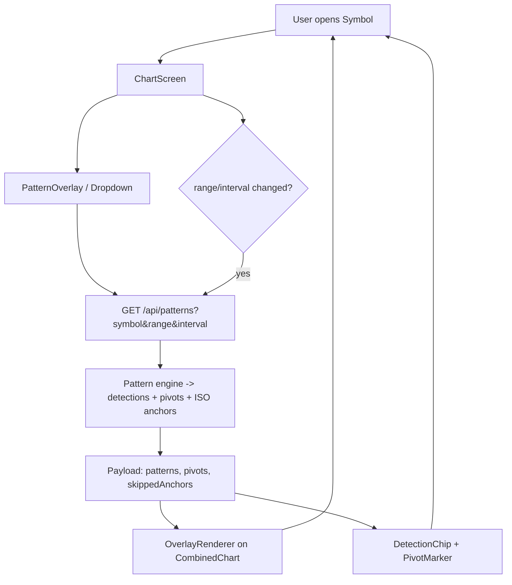
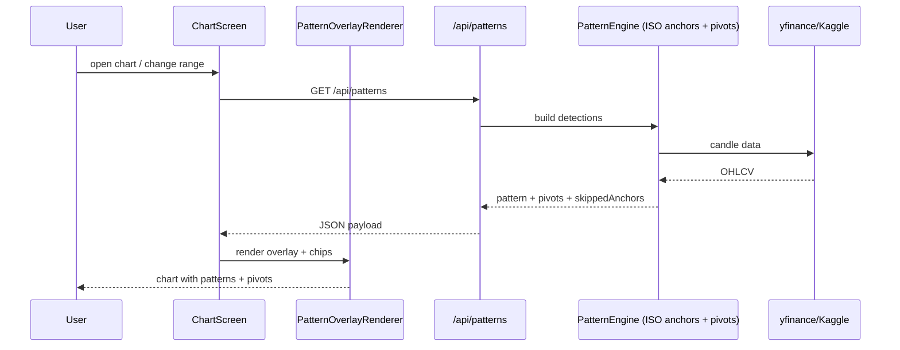

# T-37 — Pattern Engine + Pivots + ISO Anchors (plan §5.37 / AGENTS.md §6)

## Flowchart (user-facing)

```mermaid
flowchart TD
    U[User opens Symbol] --> C[ChartScreen]
    C --> P[PatternOverlay / Dropdown]
    P --> A[GET /api/patterns?symbol&range&interval]
    A --> S[Pattern engine -> detections + pivots + ISO anchors]
    S --> R[Payload: patterns, pivots, skippedAnchors]
    R --> O[OverlayRenderer on CombinedChart]
    R --> D[DetectionChip + PivotMarker]
    O --> U
    D --> U
    C --> RC{range/interval changed?}
    RC -->|yes| A
```

## Sequence: pattern fetch + overlay

```mermaid
sequenceDiagram
    participant U as User
    participant CS as ChartScreen
    participant PO as PatternOverlayRenderer
    participant A as /api/patterns
    participant S as PatternEngine (ISO anchors + pivots)
    participant Y as yfinance/Kaggle
    U->>CS: open chart / change range
    CS->>A: GET /api/patterns
    A->>S: build detections
    S->>Y: candle data
    Y-->>S: OHLCV
    S-->>A: pattern + pivots + skippedAnchors
    A-->>CS: JSON payload
    CS->>PO: render overlay + chips
    PO-->>U: chart with patterns + pivots
```
