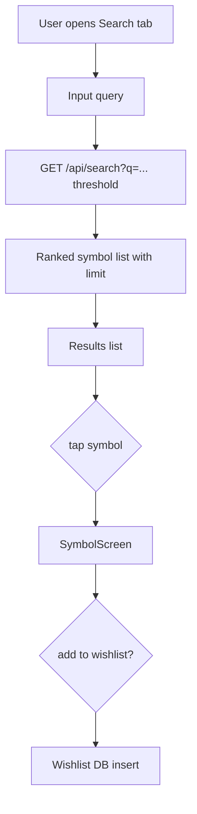
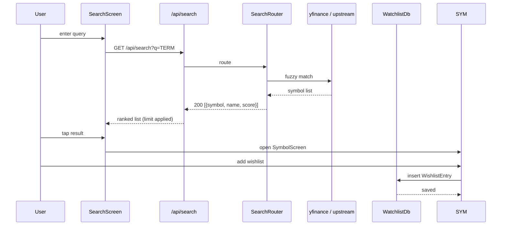

# T-43 — Fuzzy Search + Limit (plan §5.35 / AGENTS.md §6)

## Flowchart (user-facing)

```mermaid
flowchart TD
    U[User opens Search tab] --> I[Input query]
    I --> F[GET /api/search?q=... threshold]
    F --> R[Ranked symbol list with limit]
    R --> L[Results list]
    L --> T{tap symbol}
    T --> SYM[SymbolScreen]
    SYM --> W{add to wishlist?}
    W --> DB[Wishlist DB insert]
```

## Sequence: search -> result -> symbol

```mermaid
sequenceDiagram
    participant U as User
    participant SS as SearchScreen
    participant A as /api/search
    participant S as SearchRouter
    participant Y as yfinance / upstream
    participant DB as WatchlistDb
    U->>SS: enter query
    SS->>A: GET /api/search?q=TERM
    A->>S: route
    S->>Y: fuzzy match
    Y-->>S: symbol list
    S-->>A: 200 [{symbol, name, score}]
    A-->>SS: ranked list (limit applied)
    U->>SS: tap result
    SS->>SYM: open SymbolScreen
    U->>SYM: add wishlist
    SYM->>DB: insert WishlistEntry
    DB-->>SYM: saved
```
