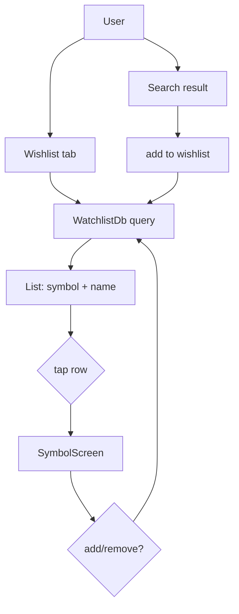
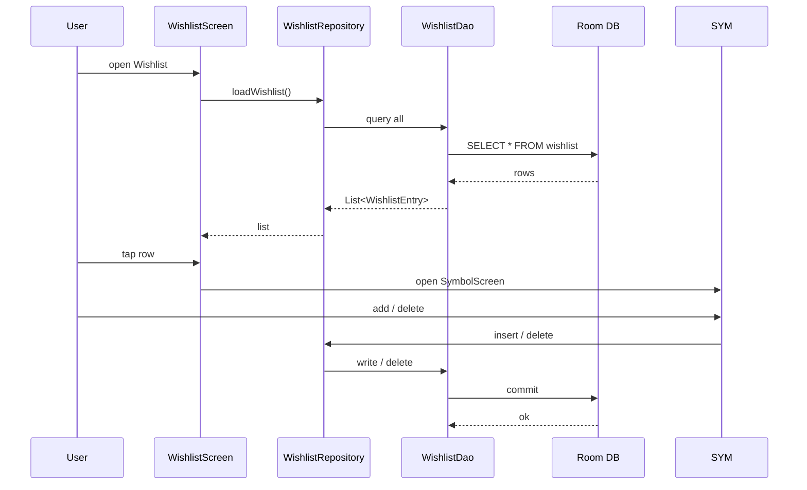

# T-44 — Wishlist (plan §4 / AGENTS.md §6)

## Flowchart (user-facing)

```mermaid
flowchart TD
    U[User] --> W[Wishlist tab]
    W --> DB[WatchlistDb query]
    DB --> L[List: symbol + name]
    L --> T{tap row}
    T --> SYM[SymbolScreen]
    SYM --> A{add/remove?}
    A --> DB
    U --> S[Search result]
    S --> A2[add to wishlist]
    A2 --> DB
```

## Sequence: DB -> list -> add/remove

```mermaid
sequenceDiagram
    participant U as User
    participant WS as WishlistScreen
    participant R as WishlistRepository
    participant DAO as WishlistDao
    participant DB as Room DB
    U->>WS: open Wishlist
    WS->>R: loadWishlist()
    R->>DAO: query all
    DAO->>DB: SELECT * FROM wishlist
    DB-->>DAO: rows
    DAO-->>R: List<WishlistEntry>
    R-->>WS: list
    U->>WS: tap row
    WS->>SYM: open SymbolScreen
    U->>SYM: add / delete
    SYM->>R: insert / delete
    R->>DAO: write / delete
    DAO->>DB: commit
    DB-->>DAO: ok
```
